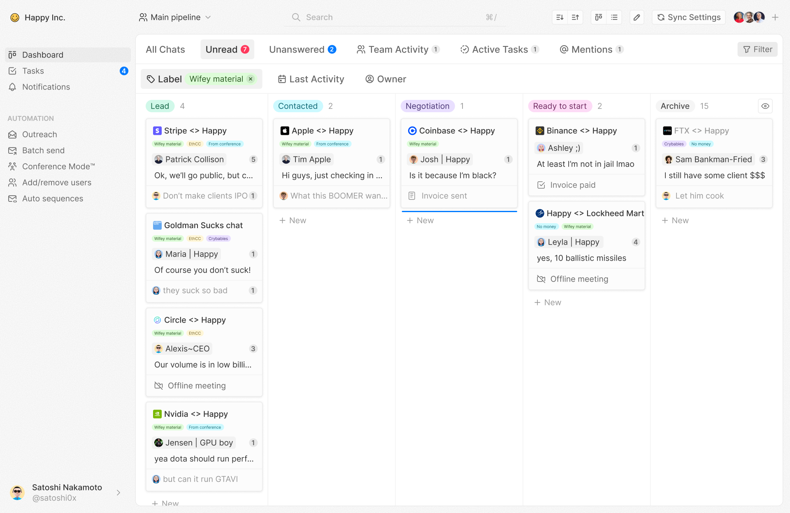

---

At Dise, we’re reinventing customer management solutions for the messenger-first world and AI era—building a single platform for people and AI agents to collaborate on DMs. Sales teams can finally turn messy chats in messengers and social media into structured pipelines and spin up AI SDRs to automate the routine. AI agents get structured access to client chats and internal data—turning messaging chaos into programmable workflows.

We’ve already built the best all-in-one Telegram CRM software on the market—with AI summaries, auto follow-ups, auto sequences, batch sending, Telegram outreach, tasks, teamwork, and more. It can serve perfectly as a Web3 CRM, since in B2B crypto sales, all communication happens in Telegram. We know the crypto sales problem firsthand: in our previous business in the space, we had thousands of chats with clients in our Telegram inbox. Our early adopters say it’s what they’ve been waiting for for years.

With AI evolving at lightning speed, we know we won’t solve every use case alone. That’s why we will open up Dise as a platform for deploying third-party agents—so others can build agents on top of our messenger-native foundation, with unique access to chats and aggregated client data.

For now, check out [Telegram CRM](https://www.disecrm.com/)—and stay tuned.
